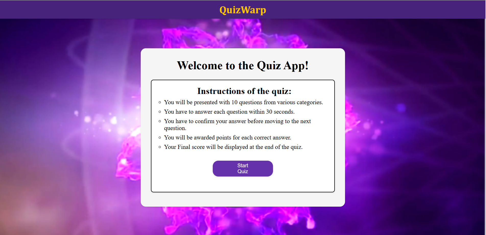
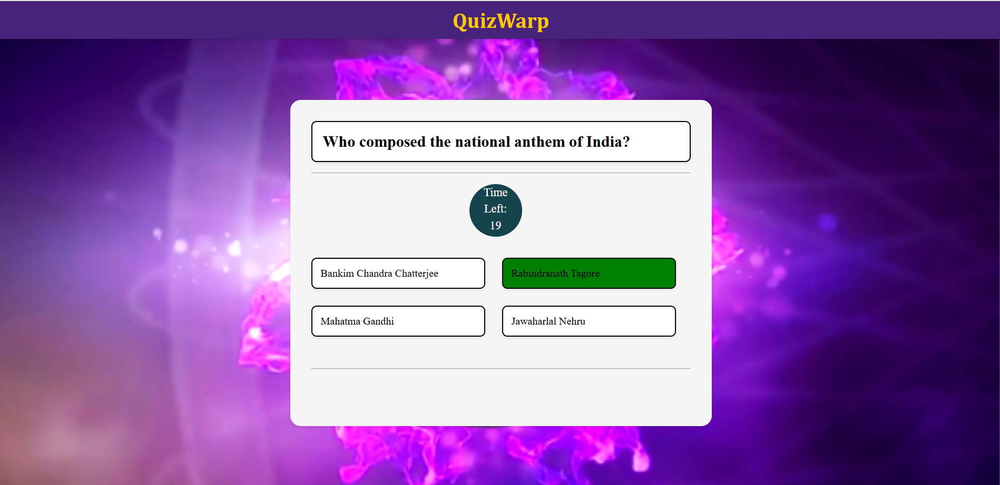
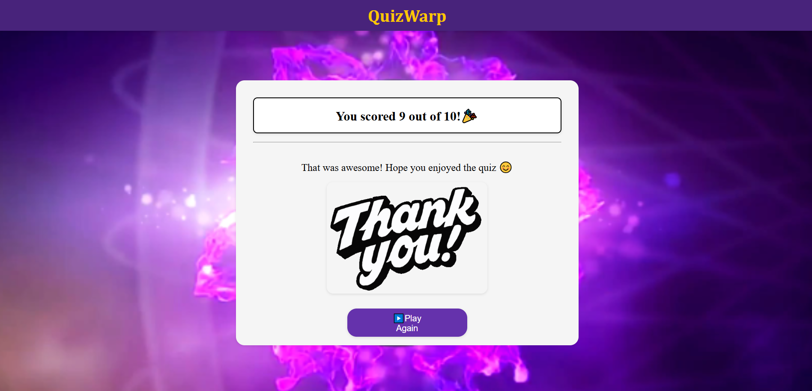

# 🎯 QuizWarp – Interactive Quiz Web Application

A modern, interactive **Quiz web application** built using **HTML, CSS, and Vanilla JavaScript**, featuring timed questions, real-time feedback, sound effects, score calculation, and persistent high-score tracking for an engaging user experience.

---

## 📌 Table of Contents

- [✨ Features](#-features)
- [📸 Screenshots](#-screenshots)
- [🛠️ Tech Stack](#️-tech-stack)
- [📦 Installation](#-installation)
- [🚀 Usage](#-usage)
- [🎨 UI--ux-highlights](#-ui--ux-highlights)
- [🧠 Quiz Logic Overview](#-quiz-logic-overview)
- [💾 Persistent Storage](#-persistent-storage)
- [🗂️ Project Structure](#️-project-structure)
- [🔐 Accessibility & Quality](#-accessibility--quality)
- [📚 What I Learned](#-what-i-learned)
- [🚢 Deployment](#-deployment)
- [📄 License](#-license)
- [👨‍💻 Author](#-author)

---

## ✨ Features

### 🎯 Core Features
- **Timed Quiz Gameplay** – Each question must be answered within a fixed time limit  
- **Multiple Choice Questions** – Four options per question  
- **Real-Time Countdown Timer** – Auto-submission when time runs out  
- **Score Calculation System** – Points awarded and deducted based on answers  
- **Instant Feedback** – Visual and audio feedback for correct and wrong answers  
- **Final Result Summary** – Displays score, accuracy, and performance message  

### 🔊 Interactive Enhancements
- Sound effects for click, correct, wrong, and timer events  
- Disabled options after answer confirmation  
- Smooth transition between questions  

---

## 📸 Screenshots

> Screenshots showing quiz flow, timer, answer feedback, and final results.





---

## 🛠️ Tech Stack

### Frontend
- **HTML5** – Semantic structure  
- **CSS3** – Layout, responsiveness, and styling  
- **Vanilla JavaScript** – Quiz logic and state management  

### Audio & APIs
- **HTML5 Audio API** – Sound effects  
- **LocalStorage API** – Persistent high-score storage  

---

## 📦 Installation

### Prerequisites
- Any modern web browser (Chrome, Edge, Firefox)  
- No frameworks or backend required  

### Steps
~~~bash
git clone https://github.com/vedansh-pandey18/QuizWarp.git
cd QuizWarp
~~~

Open **`index.html`** directly in your browser.

---

## 🚀 Usage

### Getting Started
1. Open the quiz application in your browser  
2. Read the quiz instructions  
3. Click **Start Quiz**  
4. Answer questions before the timer expires  
5. View your final score and performance summary  

### 🎮 Controls
- **Mouse Click** – Select an option  
- **Timer** – Automatically submits when time ends  
- **Restart Button** – Restart the quiz after completion  

---

## 🎨 UI & UX Highlights

- Clean and distraction-free quiz interface  
- Prominent timer display for time-bound gameplay  
- Immediate visual feedback for answers  
- Responsive layout for mobile and desktop  
- Simple and intuitive user flow  

---

## 🧠 Quiz Logic Overview

- Centralized quiz state management  
- Dynamic question loading  
- Countdown timer per question  
- Automatic answer evaluation  
- Score calculation with penalties  
- End-of-quiz result generation  

---

## 💾 Persistent Storage

Stored using **LocalStorage**:
- Highest score achieved  

High score persists across browser reloads.

---

## 🗂️ Project Structure

~~~text
quizwarp/
├── screenshots/
│   ├── start-screen.png
│   ├── question-screen.png
│   ├── result-screen.png
│
├── index.html        # Main HTML structure
├── style.css         # Styling and layout
├── script.js         # Quiz logic and timer handling
│
├── bgsoundeffect.mp3
├── click.mp3
├── correct.mp3
├── wrong.mp3
├── timerclock.mp3
│
└── README.md
~~~

---

## 🔐 Accessibility & Quality

- Clear visual feedback for interactions  
- Logical tab order for usability  
- No external dependencies  
- Clean separation of structure, style, and logic  
- Error-free execution in modern browsers  

---

## 📚 What I Learned

- Implementing timers and real-time UI updates  
- Managing application state using Vanilla JavaScript  
- Handling sound effects in web applications  
- Using LocalStorage for persistent data  
- Writing clean, maintainable frontend code  

---

## 🚢 Deployment

This project can be deployed on:
- **GitHub Pages**
- **Netlify**
- **Vercel**

Upload the static files and set `index.html` as the entry point.

---

## 📄 License

This project is licensed under the **MIT License**.

---

## 👨‍💻 Author

**Vedansh Pandey**  
Built with ❤️ using clean frontend development practices.
```
